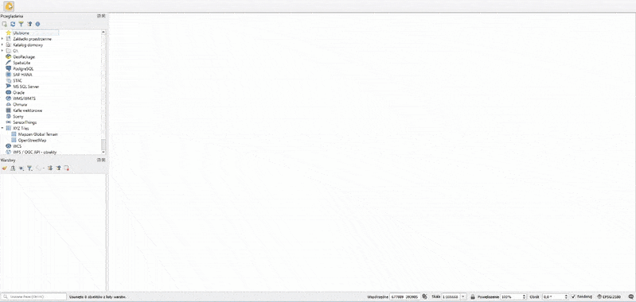

# Fotowoltaika LP

## PL

Wtyczka pozwala na wyznaczanie miejsc lokalizacji dla farm fotowoltaicznych na gruntach w zarządzie Lasów Państwowych.

### Wymagania:
Warunkiem koniecznym do prawidłowego działania wtyczki jest posiadanie wersji QGIS 3.28.0 lub wyższej.

#### Warstwy pochodne niezbędne do działania wtyczki:
- pow_pol.shp
- wydz_pol.shp
- kom_lin.shp
- oddz_pol.shp
- ow_pkt.shp
- nadl_pol.shp

Przykładowy zestaw warstw pochodnych jest dostępny w rozdziale "Releases" na Github.

### Instrukcja pobrania:
1. Wtyczkę należy zainstalować w QGIS jako ZIP bądź wgrać pliki wtyczki do lokalizacji `C:\Users\User\AppData\Roaming\QGIS\QGIS3\profiles\default\python\plugins`.
2. Aby uruchomić wtyczkę, należy kliknąć na ikonę fotowoltaiki ze słońcem.
3. Jeżeli ikona wtyczki nie jest widoczna w panelu warstw, spróbuj zrestartować QGIS.
4. Jeżeli wtyczka nadal nie jest widoczna, należy przejść w QGIS Desktop do Wtyczki -> Zarządzanie wtyczkami -> Zainstalowane -> Fotowoltaika LP -> Odinstalować wtyczkę i zainstalować ponownie.

### Instrukcja użytkowania:
1. W oknie wtyczki, w sekcji Wczytywanie danych, kliknij przycisk "WCZYTAJ WARSTWY POCHODNE". Otworzy się okno wyboru folderu zip z warstwami pochodnymi dla danego nadleśnictwa, pobranym z Systemu Informatycznego Lasów Państwowych.
2. Po wybraniu folderu zip z warstwami pochodnymi do projektu zostaną załadowane warstwy z drogami leśnymi i wydzieleniami leśnymi danego nadleśnictwa, a także mapa bazowa – Rastrowa Mapa Topograficzna Polski.
3. W oknie wtyczki, w sekcji Wczytywanie danych, kliknij przycisk "POBIERZ I WYŚWIETL DANE BDOT10K".
4. Do projektu zostanie załadowana warstwa linii energetycznych i dróg z BDOT10k dla powiatów, w obrębie których znajdują się wydzielenia leśne danego nadleśnictwa. Ładowanie danych może potrwać kilka minut.
5. Po załadowaniu ww. warstw można przystąpić do wykonania analizy na potrzeby farm fotowoltaicznych. Należy kliknąć przycisk "WYKONAJ ANALIZĘ NA POTRZEBY FOTOWOLTAIKI W LP". Analiza może potrwać kilka minut.
6. Do projektu zostaną załadowane warstwy z wyznaczonymi obszarami, a także warstwy z najbliższymi liniami energetycznymi i najbliższymi drogami.
7. Możliwości wtyczki:
    - Wtyczka pozwala na zapisanie warstw z wyznaczonymi obszarami, najbliższymi liniami energetycznymi i najbliższymi drogami do pliku Shapefile po kliknięciu przycisku "ZAPISZ WARSTWY" i wybraniu lokalizacji zapisu w oknie dialogowym.
    - Wtyczka umożliwia również wygenerowanie dokumentu w formacie PDF lub obrazu rastrowego po kliknięciu przycisku "GENERUJ WYDRUK" i zapisaniu go w lokalizacji wybranej w oknie dialogowym.
    - Możliwe jest również wygenerowanie raportu (plik XLSX) z tabelarycznym wykazem wyznaczonych obszarów oraz podanymi odległościami od najbliższych dróg i linii energetycznych wraz z ich rodzajem. W tym celu należy kliknąć przycisk "GENERUJ RAPORT".
8. Na każdym etapie można wyczyścić dane za pomocą przycisku "Wyczyść".

### Uwagi
- Ikona ze znakiem zapytania w oknie wtyczki pozwala na pobranie instrukcji obsługi wtyczki w formacie PDF.
- Do prawidłowego działania wtyczki niezbędne jest połączenie z Internetem oraz zainstalowany program do obsługi arkuszy kalkulacyjnych.
- Rekomendowane wersje QGIS: 3.34.4.

#### Wyznaczone obszary muszą spełnić następujące warunki:
- być w zarządzie PGL LP,
- mieć powierzchnię powyżej 1.5 ha (pojedyncze wydzielenia leśne lub grupa sąsiadujących wydzieleń),
- być gruntami rolnymi,
- zaliczać się do IV lub poniżej klasy bonitacji gleby.

#### Przykład użycia

## EN

The plugin allows for the identification of suitable locations for photovoltaic power stations on land managed by the State Forests (PGL LP).

### Requirements:
To use the plugin, you need QGIS version 3.28.0 or higher.

#### Necessary layers for the plugin:
- pow_pol.shp
- wydz_pol.shp
- kom_lin.shp
- oddz_pol.shp
- ow_pkt.shp
- nadl_pol.shp

An example set of layers is located in the "Releases" section on Github.

### Installation instructions:
1. Install the plugin in QGIS as a ZIP file or upload the plugin files to the location `C:\Users\User\AppData\Roaming\QGIS\QGIS3\profiles\default\python\plugins`.
2. To activate the plugin, click on the icon with a sun and solar panel.
3. If the plugin icon is not visible in the layer panel, try restarting QGIS.
4. If the plugin is still not visible, go to QGIS Desktop -> Plugins -> Manage and Install Plugins -> Installed -> Fotowoltaika LP -> Uninstall the plugin and reinstall it.

### Usage instructions:
1. In the plugin window, under the Data Loading section, click the "WCZYTAJ WARSTWY POCHODNE" button. A window will open to select the zip folder containing derivative layers for the specific forest district, obtained from the State Forests Information System.
2. After selecting the zip folder with layers, the project will load layers with forest roads and forest compartments for the given forest district, as well as the base map – Raster Topographic Map of Poland.
3. In the plugin window, under the Data Loading section, click the "POBIERZ I WYŚWIETL DANE BDOT10K" button.
4. The BDOT10K layers for power lines and roads within the counties containing forest compartments for the given forest district will be loaded into the project. Data loading may take a few minutes.
5. Once the layers are loaded, you can proceed to perform an analysis for photovoltaic farms. Click the "WYKONAJ ANALIZĘ NA POTRZEBY FOTOWOLTAIKI W LP" button. The analysis may take a few minutes.
6. Layers with designated areas and the nearest power lines and roads will be added to the project.
7. Plugin capabilities:
   - The plugin allows you to save layers with designated areas, nearest power lines, and nearest roads to a Shapefile by clicking the "ZAPISZ WARSTWY" button and selecting the save location in the dialog box.
   - Additionally, the plugin allows you to generate a document in PDF format or a raster image by clicking the "GENERUJ WYDRUK" button and saving it in the chosen location.
   - You can also generate a report (XLSX file) with a tabular list of designated areas and distances from the nearest roads and power lines, along with their types. To do this, click the "GENERUJ RAPORT" button.
8. At any stage, you can clear data using the “Wyczyść” button.

### Notes
- The question mark icon in the plugin window allows you to download the user guide in PDF format.
- For the plugin to work correctly, an internet connection and spreadsheet editing software must be installed.
- Recomended version of QGIS: 3.34.4.

#### Designated areas must meet the following criteria:
- Managed by PGL LP,
- Have an area greater than 1.5 hectares (individual forest compartments or neighboring groups),
- Be agricultural land,
- Fall into IV or lower soil bonitation classes.
